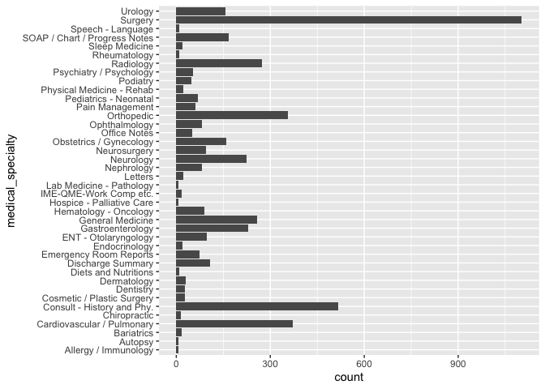

Lab 6
================

\#\#download the data

``` r
fn <- "mtsamples.csv"
if (!file.exists(fn))
  download.file("https://raw.githubusercontent.com/USCbiostats/data-science-data/master/00_mtsamples/mtsamples.csv", destfile = fn)

mtsamples <- read.csv(fn)
mtsamples <- as_tibble(mtsamples)
```

\#\#Q1 hoe many and how are specialties distributed?

``` r
specialties <- mtsamples %>%
  count(medical_specialty)

specialties %>%
  arrange(desc(n)) %>%
  top_n(15) %>%
  knitr::kable()
```

    ## Selecting by n

| medical\_specialty            |    n |
|:------------------------------|-----:|
| Surgery                       | 1103 |
| Consult - History and Phy.    |  516 |
| Cardiovascular / Pulmonary    |  372 |
| Orthopedic                    |  355 |
| Radiology                     |  273 |
| General Medicine              |  259 |
| Gastroenterology              |  230 |
| Neurology                     |  223 |
| SOAP / Chart / Progress Notes |  166 |
| Obstetrics / Gynecology       |  160 |
| Urology                       |  158 |
| Discharge Summary             |  108 |
| ENT - Otolaryngology          |   98 |
| Neurosurgery                  |   94 |
| Hematology - Oncology         |   90 |

``` r
# Method 1 (not that pretty)
ggplot(mtsamples, aes(x = medical_specialty)) +
  geom_histogram(stat = "count") +
  coord_flip()
```

<!-- -->

``` r
# Method 2
ggplot(specialties, aes(x = n, y = fct_reorder(medical_specialty, n))) +
  geom_col()
```

<!-- -->

These are not evenly (uniformly) distributed.

\#\#Q2

``` r
mtsamples %>%
  unnest_tokens(output = word, input = transcription) %>%
  count(word, sort = TRUE) %>%
  top_n(20) %>%
  ggplot(aes(x = n, y = fct_reorder(word, n))) +
    geom_col()
```

    ## Selecting by n

<!-- -->

The word “patient” seems to be important, but we observe a lot of
stopwords

\#Q3

``` r
mtsamples %>%
  unnest_tokens(output = word, input = transcription) %>%
  count(word, sort = TRUE) %>%
  anti_join(stop_words, by = "word") %>%
  # Using regular expressions to remove numbers
  filter(!grepl(pattern = "^[0-9]+$", x = word)) %>%
  top_n(20) %>%
  ggplot(aes(x = n, y = fct_reorder(word, n))) +
    geom_col()
```

    ## Selecting by n

<!-- -->

Looking better~~, but we don’t like the numbers~~.

\#Q4

``` r
mtsamples %>%
  unnest_ngrams(output = bigram, input = transcription, n = 2) %>%
  count(bigram, sort = TRUE) %>%
  top_n(20) %>%
  ggplot(aes(x = n, y = fct_reorder(bigram, n))) +
    geom_col()
```

    ## Selecting by n

<!-- --> Using bi-grams
is not very informative, let’s try with tri-grams instead.

``` r
mtsamples %>%
  unnest_ngrams(output = trigram, input = transcription, n = 3) %>%
  count(trigram, sort = TRUE) %>%
  top_n(20) %>%
  ggplot(aes(x = n, y = fct_reorder(trigram, n))) +
    geom_col()
```

    ## Selecting by n

<!-- -->

\#Q5

``` r
bigrams <- mtsamples %>%
  unnest_ngrams(output = bigram, input = transcription, n = 2) %>%
  separate(bigram, into = c("w1", "w2"), sep = " ") %>%
  filter((w1 == "history") | (w2 == "history"))

bigrams %>%
  filter(w1 == "history") %>%
  select(w1, w2) %>%
  count(w2, sort = TRUE)
```

    ## # A tibble: 369 x 2
    ##    w2                  n
    ##    <chr>           <int>
    ##  1 of               4537
    ##  2 the               761
    ##  3 she               279
    ##  4 he                227
    ##  5 significant       200
    ##  6 this              200
    ##  7 and               197
    ##  8 1                 181
    ##  9 is                172
    ## 10 noncontributory   121
    ## # … with 359 more rows

``` r
bigrams %>%
  filter(w2 == "history") %>%
  select(w1, w2) %>%
  count(w1, sort = TRUE)
```

    ## # A tibble: 567 x 2
    ##    w1           n
    ##    <chr>    <int>
    ##  1 medical   1223
    ##  2 family     941
    ##  3 a          939
    ##  4 social     865
    ##  5 surgical   491
    ##  6 no         473
    ##  7 with       163
    ##  8 any        129
    ##  9 brief      125
    ## 10 the        107
    ## # … with 557 more rows

``` r
bigrams %>%
  filter(w2 == "history")%>%
  select(w1, w2) %>%
  count(w1, sort = TRUE)
```

    ## # A tibble: 567 x 2
    ##    w1           n
    ##    <chr>    <int>
    ##  1 medical   1223
    ##  2 family     941
    ##  3 a          939
    ##  4 social     865
    ##  5 surgical   491
    ##  6 no         473
    ##  7 with       163
    ##  8 any        129
    ##  9 brief      125
    ## 10 the        107
    ## # … with 557 more rows

Since we are looking at single words again, it is good idea to treat
these as single tokens. So let’s remove the stopwords and the numbers

``` r
bigrams %>%
  filter(w1 == "history") %>%
  filter(!(w2 %in% stop_words$word) & !grepl("^[0-9]+$", w2)) %>%
  count(w2, sort = TRUE) %>%
  top_n(10) %>%
  knitr::kable()
```

    ## Selecting by n

| w2              |   n |
|:----------------|----:|
| significant     | 200 |
| noncontributory | 121 |
| patient         | 101 |
| negative        |  96 |
| positive        |  87 |
| unremarkable    |  53 |
| hypertension    |  50 |
| includes        |  47 |
| mother          |  43 |
| history         |  42 |

``` r
bigrams %>%
  filter(w2 == "history") %>%
  filter(!(w1 %in% stop_words$word) & !grepl("^[0-9]+$", w1)) %>%
  count(w1, sort = TRUE) %>%
  top_n(10) %>%
  knitr::kable()
```

    ## Selecting by n

| w1          |    n |
|:------------|-----:|
| medical     | 1223 |
| family      |  941 |
| social      |  865 |
| surgical    |  491 |
| pain        |   98 |
| psychiatric |   90 |
| prior       |   87 |
| past        |   80 |
| previous    |   72 |
| personal    |   55 |
